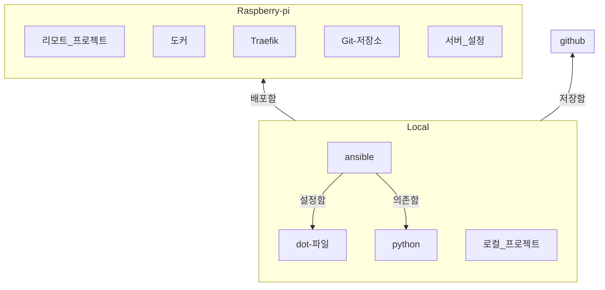

# 나의 인프라 구조

서버의 능력이 내가 가진 로컬 컴퓨터의 능력을 넘어설 때, 언제 어디에서든지 ssh 접속을 할 수 있을 때, ssh 접속 후 코드를 작성, 실행하는 것이 유용하다.
하지만 접속을 할 수 없을 때 글을 쓰지 못하기 때문에 이는 '인터넷 접속'을 항상 필요로 한다.
그렇기에 가장 좋은 방법을 로컬에서 글을 작성하고 이를 서버에 복사하는 것이다.
이는 실제로 구현하기에 가장 쉽다. git이 ssh를 지원하기 때문에 나는 그냥 git push만 하면 된다.
그러나 이는 나의 서버와 로컬 컴퓨터에 아주 강하게 의존한다. 
어느 괴한이 집에 찾아와 서버와 로컬 컴퓨터를 훔쳐간다면 나는 내 노트를 전부 잃어버리게 된다.
그래서 나는 클라우드도 사용해야 한다. 
github에 개인 저장소를 만들어 나만 볼 수 있는 환경을 만들어 두는 게 좋겠다. 

결국 나의 노트와 코드는 로컬, 클라우드, 개인 서버에 분산되어 있어 안정성이 올라간다.

ansible은 먼저 로컬 컴퓨터와 라즈베리 파이를 호스트로 갖고 설정파일부터 생성해야한다. 

