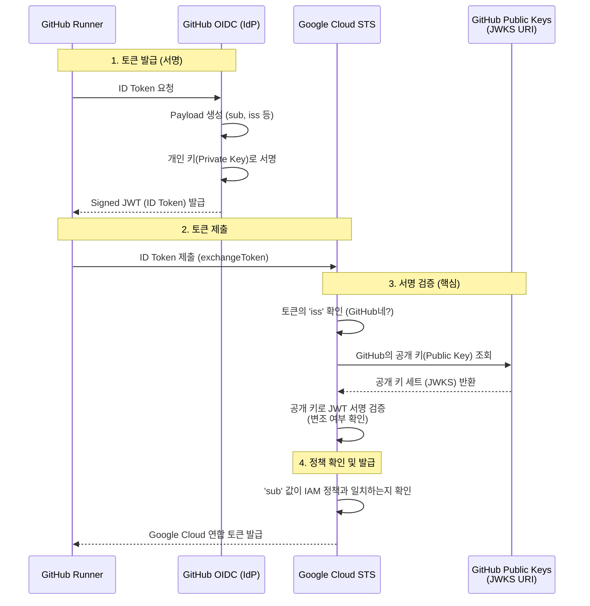
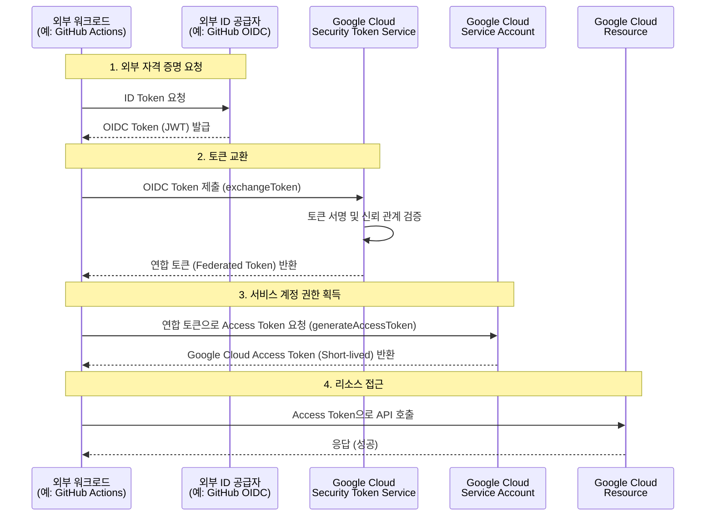

# Workload Identity Federation (WIF) Pool이란?

**Workload Identity Federation (WIF)** 은 Google Cloud 외부(예: AWS, Azure, GitHub Actions, On-premise)에서 실행되는 워크로드(작업) 가 **서비스 계정 키(Service Account Key)를 관리하지 않고도** Google Cloud 리소스에 안전하게 액세스할 수 있도록 해주는 기능입니다.

**Workload Identity Pool (WIF Pool)** 은 이러한 외부 ID(Identity)들을 관리하고 조직화하는 컨테이너 역할을 합니다.

## 'Pool'이란 무엇이며 왜 필요한가요?

**1. 'Pool'의 의미 (What)**
'Pool'은 사전적으로 '웅덩이'나 '공동 이용 자원'을 의미합니다. 여기서는 **"외부 신원(Identity)들을 담아두는 논리적인 그릇(Container)"** 이라고 이해하면 쉽습니다.
*   서로 다른 외부 환경(예: AWS의 특정 계정, GitHub OIDC)에서 오는 ID들을 하나의 그룹으로 묶어서 관리하기 위한 단위입니다.

**2. 왜 'Pool' 개념이 나왔나요? (Why)**
Google Cloud 입장에서는 외부에서 들어오는 요청이 "누구"인지 식별하고 관리해야 하는데, 개별 ID마다 일일이 규칙을 정하는 것은 비효율적입니다.

*   **관리의 효율성 (Namespace 격리)**:
    *   수많은 외부 ID(AWS 역할, GitHub 리포지토리 등)가 섞이지 않도록 격리합니다.
    *   예: `개발팀-AWS-Pool`, `운영팀-GitHub-Pool` 처럼 용도나 출처별로 나누어 관리할 수 있습니다.
*   **공통 정책 적용 (Policy Boundary)**:
    *   Pool 단위로 "이 Pool에 속한 ID들은 Google Cloud의 어떤 서비스 계정을 사용할 수 있다"는 IAM 정책을 묶어서 적용할 수 있습니다.
    *   마치 회사에서 '인사팀', '개발팀' 부서를 나누고 부서별로 출입 권한을 주는 것과 같습니다.
*   **충돌 방지**:
    *   서로 다른 공급자(Provider)에서 우연히 같은 ID 값을 사용하더라도, 서로 다른 Pool에 있다면 구분될 수 있습니다.

## OIDC (OpenID Connect) 심층 분석

단순히 "디지털 신분증"이라는 개념을 넘어, 기술적으로 어떻게 신뢰가 형성되는지 자세히 알아봅니다.

### 1. 핵심 원리: 비대칭 키 암호화와 JWT

OIDC의 핵심은 **"내가 발행한 게 맞으니 믿어도 된다"** 는 보증을 **전자 서명**을 통해 하는 것입니다.

*   **JWT (JSON Web Token)**: OIDC에서 신분증 역할을 하는 토큰 포맷입니다.
    *   **Header**: 암호화 알고리즘 정보 (예: RS256)
    *   **Payload**: 실제 데이터 (누구인지, 언제 만료되는지 등)
    *   **Signature**: Header와 Payload가 변조되지 않았음을 증명하는 서명

### 2. 신뢰의 연결 고리 (Trust Chain)

Google Cloud가 외부인 GitHub를 어떻게 믿을까요? 비밀번호를 공유하는 것이 아니라, **공개 키(Public Key)**를 통해 검증합니다.

1.  **서명 (Signing)**: GitHub(IdP)는 자신만이 가진 **개인 키(Private Key)**로 토큰에 서명합니다.
2.  **공개 (Discovery)**: GitHub는 누구나 볼 수 있는 주소(예: `/.well-known/openid-configuration`)에 자신의 **공개 키(Public Key)** 목록(JWKS)을 게시해 둡니다.
3.  **검증 (Verification)**: Google Cloud(STS)는 GitHub가 게시한 공개 키를 가져와서, 토큰의 서명을 풀어봅니다. 서명이 풀린다면 "아, 이건 진짜 GitHub가 개인 키로 서명한 게 맞구나"라고 확신할 수 있습니다.

### 3. 실제 데이터 예시 (GitHub Actions JWT)

GitHub Actions에서 Google Cloud로 보내는 토큰(Payload)을 뜯어보면 다음과 같습니다.

```json
{
  "iss": "https://token.actions.githubusercontent.com",  // 발급자 (GitHub)
  "sub": "repo:my-org/my-repo:ref:refs/heads/main",      // 주체 (누구인가? - 리포지토리+브랜치)
  "aud": "https://iam.googleapis.com/projects/1234...",  // 관객 (누구에게 주는 건가? - Google Cloud)
  "exp": 1630000000,                                     // 만료 시간
  "repository": "my-org/my-repo",                        // 추가 정보 (리포지토리)
  "actor": "user-name"                                   // 추가 정보 (실행한 사람)
}
```

*   **`sub` (Subject)**: 가장 중요합니다. WIF Pool 설정에서 이 값을 보고 "이 리포지토리의 main 브랜치에서 온 요청이구나"라고 식별하여 권한을 줍니다.

### 4. 상세 작동 다이어그램 (JWKS 검증 포함)



## 주요 개념

1.  **Workload Identity Pool (풀)**:
    *   외부 ID 공급자(IdP)를 그룹화하는 엔티티입니다.
    *   예를 들어, "GitHub Actions용 풀"이나 "AWS용 풀"을 만들 수 있습니다.
    *   IAM 정책을 통해 이 풀에 속한 ID가 특정 서비스 계정을 사용할 수 있도록 권한을 부여합니다.

2.  **Workload Identity Provider (공급자)**:
    *   풀 안에 포함되며, 실제 외부 ID 공급자(예: GitHub, AWS)와 Google Cloud 간의 신뢰 관계를 정의합니다.
    *   OIDC(OpenID Connect) 또는 SAML 2.0을 지원합니다.

## 작동 방식 (메커니즘)

키(Key)를 사용하는 대신, **토큰 교환(Token Exchange)** 방식을 사용합니다.

1.  **외부 자격 증명 확보**: 외부 워크로드(예: GitHub Actions Runner)가 자신의 ID 공급자(GitHub)로부터 자격 증명(ID Token/OIDC Token)을 받습니다.
2.  **토큰 교환 (STS)**: 워크로드는 이 외부 토큰을 Google Cloud의 **Security Token Service (STS)**로 보냅니다.
3.  **검증 및 연합 토큰 발급**: STS는 외부 토큰의 서명을 검증하고, 신뢰 관계(WIF Provider 설정)를 확인한 후, Google Cloud용 **연합 토큰(Federated Token)**을 반환합니다.
4.  **서비스 계정 임퍼스네이션 (Impersonation)**: 워크로드는 이 연합 토큰을 사용하여 Google Cloud 서비스 계정의 액세스 토큰(Access Token)을 요청합니다.
5.  **리소스 액세스**: 발급받은 서비스 계정 액세스 토큰으로 Google Cloud 리소스(예: GKE, Cloud Storage 등)에 접근합니다.

## 시각화 (Mermaid Diagram)

아래 다이어그램은 GitHub Actions가 WIF를 통해 Google Cloud에 접근하는 과정을 보여줍니다.



## 왜 WIF Pool을 사용해야 하나요?

*   **보안 강화 (Keyless)**: 장기 수명(Long-lived) 서비스 계정 키(JSON 파일)를 저장하거나 관리할 필요가 없습니다. 키 유출 위험이 사라집니다.
*   **단기 토큰 사용**: 발급받은 토큰은 수명이 짧아(Short-lived), 만료되면 더 이상 사용할 수 없습니다.
*   **중앙 집중식 관리**: Google Cloud IAM을 통해 외부 ID가 어떤 권한을 가질지 세밀하게 제어할 수 있습니다.
